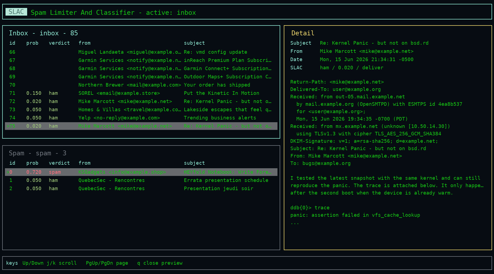

# SLAC

SLAC is Spam Limiter And Classifier: a Rust mail delivery agent for OpenBSD
`smtpd`. It classifies mail with an OpenAI-compatible chat completions endpoint,
adds `X-SLAC-*` headers, can quarantine spam to an mbox, and provides CLI/TUI
tools for reviewing and correcting classifications.

SLAC is intentionally local and OpenBSD-focused. It is designed to be invoked by
OpenSMTPD as an external MDA, read one message from stdin, classify it, then
either delegate normal delivery to `mail.local` or append the message to a spam
mbox.

## Features

- OpenAI-compatible `/v1/chat/completions` classifier support.
- Conservative fail-open behavior: classifier/config/model failures deliver
  normally instead of losing mail.
- `X-SLAC-*` headers on processed mail.
- Optional quarantine to standard Unix mbox, defaulting to `~/spam`.
- TUI and CLI tools for reviewing inbox/spam and moving misclassified mail.
- Correction history and message snapshots used as bounded prompt feedback.

## Build

```sh
cargo build --release
doas install -o root -g bin -m 0555 target/release/slac /usr/local/bin/slac
```

## Configuration

Start from:

```sh
cp examples/slac.toml /etc/slac.toml
```

Config search order is:

1. `-c /path/to/slac.toml`
2. `~/.config/slac/slac.toml`
3. `/etc/slac.toml`
4. built-in defaults

The default example uses a local OpenAI-compatible endpoint:

```toml
[llm]
endpoint = "http://127.0.0.1:8080/v1/chat/completions"
model = "local-model"
```

Start with observe mode while testing:

```toml
[classification]
observe_only = true
add_headers = true
```

When `observe_only = true`, SLAC classifies and annotates mail, but always
delivers normally. After you are comfortable with the classifications, enable
quarantine:

```toml
[classification]
observe_only = false
spam_threshold = 0.95

[quarantine]
path = "{home}/spam"
require_verdict = "spam"
```

## OpenSMTPD

Example `smtpd.conf` action:

```smtpd
action "local_slac" mda "/usr/local/bin/slac -c /etc/slac.toml mda" alias <aliases>
match for local action "local_slac"
```

See `examples/smtpd.conf` for a complete minimal example.

Validate and reload OpenSMTPD after editing:

```sh
doas smtpd -n
doas rcctl reload smtpd
```

Watch logs with:

```sh
tail -f /var/log/maillog
```

## Modes

MDA mode is the default:

```sh
slac -c /etc/slac.toml mda < message.eml
```

Debug mode also logs to stderr:

```sh
slac -d -c /etc/slac.toml mda < message.eml
```

Test the configured classifier endpoint without delivering mail:

```sh
slac -c /etc/slac.toml test
```

The test command loads the same configuration as MDA mode, prints the endpoint
and model settings to stderr, sends one synthetic classifier probe, and reports
common endpoint mistakes such as using `/v1` instead of
`/v1/chat/completions`.

## Review

The TUI provides split inbox/spam views, a message detail pane, and correction
actions for moving misclassified mail. The screenshot below uses fictitious
sample messages.



```sh
slac -c /etc/slac.toml tui
slac -c /etc/slac.toml list --mailbox spam
slac -c /etc/slac.toml show --mailbox spam --id 0
slac -c /etc/slac.toml move --mailbox spam --id 0 --to inbox --reason "false positive"
```

TUI keys:

- `Tab`: switch inbox/spam
- `Up/Down` or `j/k`: select message
- `PgUp/PgDn`: page through lists or preview
- `Enter`: open preview
- `q`: quit or close preview
- `m`: move selected message to the other mailbox
- `r`: refresh

Correction metadata is stored in `~/.local/share/slac/corrections.jsonl`, with
message snapshots under `~/.local/share/slac/corrections/messages/`.

Moved messages keep their original receipt-time `X-SLAC-*` headers and receive
separate correction headers such as `X-SLAC-User-Correction` and
`X-SLAC-Correction-Reason`.

## Safety Notes

- Do not configure a fake delivery command such as `/bin/cat` under real
  OpenSMTPD; OpenSMTPD will treat exit status `0` as successful delivery.
- SLAC does not bounce spam. Quarantine accepts the message and appends it to
  the spam mbox.
- Message ids shown by `list` and the TUI are scan indexes. Refresh after moves
  before reusing ids.
